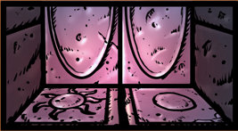

# 15: The moon and sun tiles

## Player’s Info

The floor features two slabs, one with a moon and one with a sun. Each tile also features a little key hole. The archway displays two elaborate steel doors, however neither of them have handles or visible locks.

## GM Info

These double steel doors open the room of St. Frederick’s tomb area. The party must first use the key of the gargoyles found in area 14 to activate the moon and sun tiles before these doors will open. Doing so will unlock and push the tiles deeper into the ground.

That said, an expert thief with thief tools can unlock them (DC 25). However, once the tiles have been pushed deeper into the ground, the party must pour the enchanted water onto the tiles using the moon and sun bowls. If this is done correctly, the water will fill each tile and the double steel doors open for a full hour, until everything resets.

If all is done right, the party can finally proceed into the tomb area.