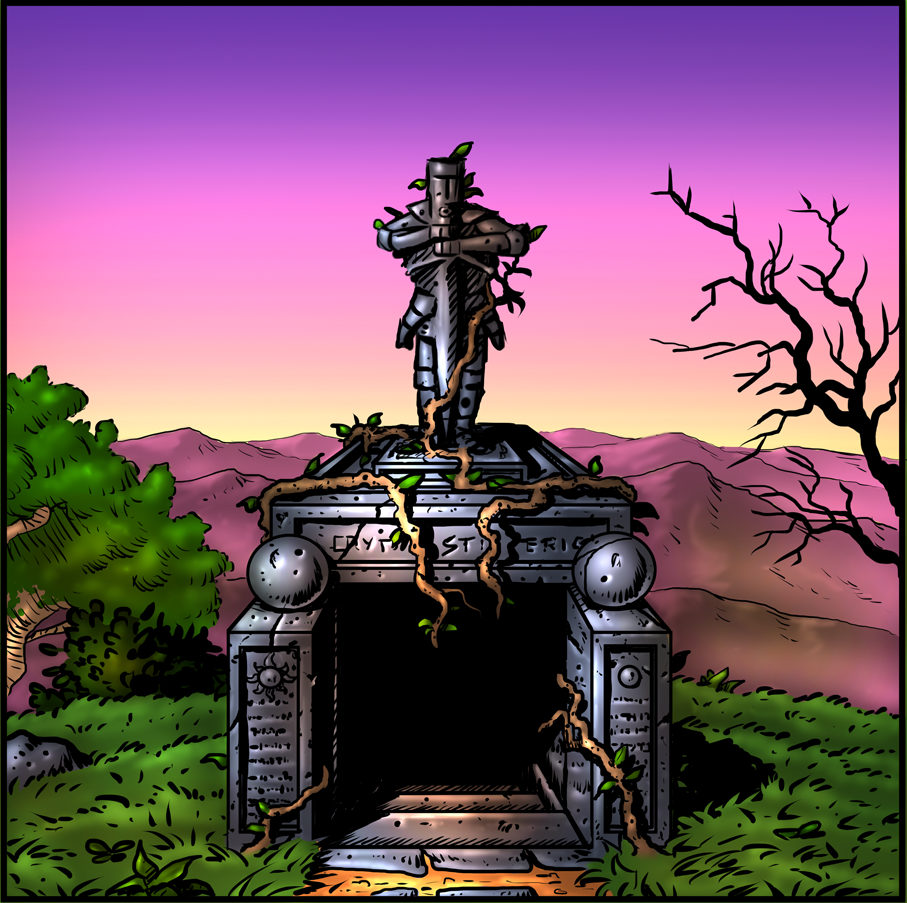

# Entrance

There is a heavy humidity, and the foul smell of rot assaults your senses as you descend the darkened stairs. Strange sounds caused by the strong, cold wind greet you at the entrance, reverberating through the nearby stairwell. 40 feet down and you begin to feel engulfed by a permeating miasma of death.

## GM Info

Unless the party has a means of seeing in the dark, the area is pitch black. The ceiling is approximately 10 feet high, the steps about 10 feet wide and about 20 feet long, but the staircase is 40 feet high so the steps are steep.

The ceiling and the walls are made of large stone bricks, however the stairs appear roughhewn, sculpted boulder.

There is a lot of dirt on the steps, tracked in by animals who’ve had direct access to the outside world. The only noises to be heard are the outside winds and the faint sounds of rippling water coming from the basin in the Hall of Welcoming. 