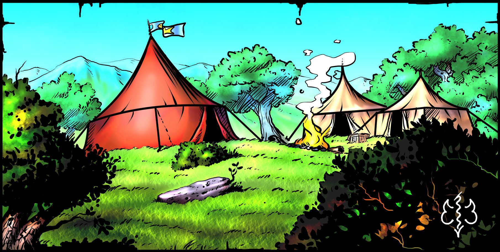
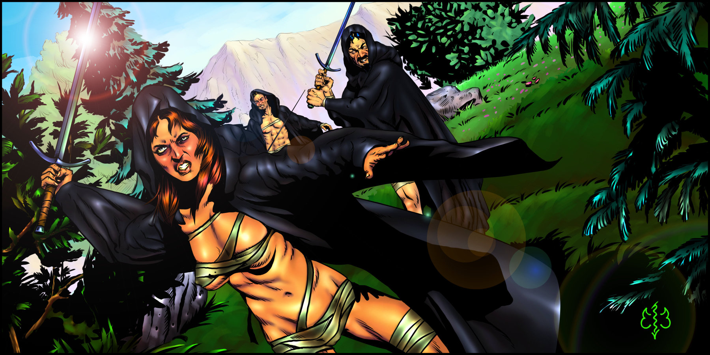
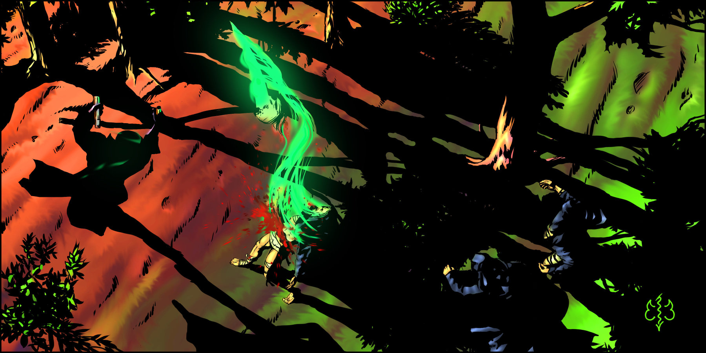

{.size-full}

# Campsite

**Read aloud:**<!--{p:.no-fancy}-->

> Your adventure begins in an encampment, surrounded by three large tents spread out over a gently sloping grassy mound. Your group stands near the largest and most luxurious tent, taking in the sights and sounds. You’re grateful to be guests awaiting a quick bite of roasted pig after your recent travels. The delicious smells filling your nostrils nearly distract from thinking of your mission, which will be far less pleasant than the meal you’re about to enjoy. The guards and nobler men in fancy outfits all stand about with worried expressions, despite the festivities, and this refreshes your memory instantly. {.no-fancy}
>
> You hadn’t been heading toward this place, but realized you had an opportunity for riches after coming across a written plea for help nailed to an old wooden post along the road. The parchment offered a reward of 2500 gold to hunt down and destroy a monster.
>
> As adventurers, monster hunting is not typically the most lucrative of pursuits, but this was an unusually high reward. The post provided the location of an imminent meeting at a camp set up by Lord Marcel Laberge as a temporary outpost.  {.read}


> Due to bad weather, you arrived by night, a bit late to for the expected convening of local soldiers. You were met with some suspicion by men at arms, but after some questioning, were led to Lord Marcel Laberge himself. He told you only mercenaries had answered their plea for help. “You must be the only ones who’d call yourselves heroes around here. But even heroes need rest, so I’ll provide more details in the morning,” Lord Laberge had said.
>
> You shared a tent with a bunch of mercenaries who didn’t sleep as well as you all did. None of you were known by name, despite recent escapades, but your confidence is likely much greater than the nervous looking men-for- hire around you.
>
>So now late morning has come, and you’re awaiting further direction.
>
>Some mercenaries stand guard at the perimeter, but most are milling about, discussing games and bragging about exploits over breakfast. That’s why you’re unable to make out what’s being said between Lord Laberge and one who appears to be a merchant. Their expressions are dire, but you can’t quite make out what they are saying due to the general din of conversation. Their voices are carried off in different directions by the cool morning breeze.{.read}

(print-page)

## Introduction

The mercenaries were more nervous at night because that is when the monster is most likely to strike, and so far, nobody has lived through an encounter.

> Pause between paragraphs of speech. Players invariably interrupt canned speech to speak. Mix and match the spoken words to natural flow of conversation, or simply paraphrase.

**Read Aloud:**

> The nobleman and merchant see you, and move their conversation toward your party. Turns out the merchant is affiliated with The Guardians’ Guild, a large, powerful guild of mercenaries and explorers. You catch on that the discussion is related to selling goods at a discount to adventurers. The lord greets you: 
>
> “Welcome, I hope you slept well and had a tasty breakfast. Although we met briefly yesterday, allow me to introduce myself more properly. I am Lord Mayor Marcel Laberge, a former knight. I could have retired, living the rest of my days wealthy, but I must oversee the townsfolk of Poisson. They are my people and they are in danger. {.read}
 
 After a pause (or answering questions) he continues...
 
 > I am terribly sorry the accommodations are makeshift, inadequate for those of either renown or infamy. However, this secluded camp serves a purpose. This matter is to be kept from common folk’s ears. We must avoid general panic leading to chaos. We are faced with a new and serious threat. Many serfs and farmers of my land have gone missing, or have been killed, and now the killings are getting closer and closer to Poisson. It’s normally goblin hordes from the southern borders causing problems, but the horrors we’ve seen speak of demonic activity. The demonic fiend known as the “Harvester of Souls” now roams the land and it must be dealt with haste for fear that it gains back its full strength and power becoming stronger and stronger as time goes by. {.read}

> **The Order of Chaplains**
>
> Chaplains use their magic in the course of their work to heal the faithful, exorcise demons, and strike down the unworthy, but also to manifest the divine favor of Sol in their services. The Order of Chaplains serves all Psarmorum. All ordained priests, from the Bishop of the city of the Temple Mount on down, are initiated members of the order. 


 > “I offer reward for those who travel to the crypt and find the sword within, then hunt down and slay the harvester in its lair, with all due haste. Fortunately, local rangers tracked down the fiend and discovered its lair where it rests and regenerates during its daytime slumber. Only one ranger made it back alive to report its whereabouts, so we know it can be awakened during the day, even if in a weakened state. Two adventuring parties before you answered our plea. However, quite regretfully, not even one member has returned. Will you be the victorious party? Are you heroic enough to fetch the sword and slay the fiend? If so great riches and fresh arable land await you! If not, we pray to Sol that someone will have the guts to save us all!” {.read}

(print-page)

## Questions

The player characters will certainly ask questions or require more info during the knight’s soliloquy.

**Questions about the fiend and its victims**: 

The lord mayor knows more than he’s willing to say, but won’t reveal why the fiend is free because he doesn’t know how that happened. But what he can say is that the “Harvester of Souls” name comes from the fact that when this fiend kills it steals the soul of its victim. Sometimes such victim comes back as a terrifying undead creature which tries to find a soul back. He also says that victims are often cut in two with just one hit. Over 60 years ago, when he was a young boy, he vividly remembers something about cultists summoning this fiend to find immortality and some cultist relatives might still exist today and may still be loyal to the “Harvester of Souls”.

> Don’t be fooled by the nature of this quest, this is no ordinary monster hunt. This fiend cannot be killed by normal means. In fact, it cannot be killed at all. It can only be stopped, and only one weapon can do that. I am referring to the sword of St. Frederick, a weapon blessed by archangel Dumah. The blade was wielded by the late paladin Frederick Lachance who once defeated the Harvester.” “Unfortunately, to protect the relic from the old cult of the ‘Harvester of Souls’, those who summoned the fiend you must now stop, the The Order of Chaplains hid St. Frederick’s holy weapon well. Nobody has been successful in an attempt to retrieve the sword.
>
> The crypt where it is hidden is filled with traps. Its wards have stopped many would be thieves, treasure hunters, and most importantly, the cultists who’d seek to control the very being they pretend to worship. We are the founding members of Chevaliers de la Chauve-Souris, and so we know where the crypt lies. However, we have no idea how one is to find the sword. Being that the harvester has returned, I can only hope the sword is still there, for all our  sakes.” {.read}

(print-column)

**Questions about the Crypt of St. Frederick**: 

> The crypt is topped by an honorary statue in the image of the paladin St. Frederick. It was ordered to be built by The Order of Chaplains. The location of the crypt is indicated on a map that the lord mayor provides. The map was drawn by a ranger who goes by the name of Robert Lafontaine, one well known locally for his cartography skills, and luckily, one of the few to survive reconnaissance around the Harvester’s lair. As mentioned, the crypt itself is filled with traps to avoid would be thieves or cultists to steal the holy sword and desecrate St. Frederick’s remains. However, the crypt was also built for his loyal followers all of whom disappeared long ago. There may be some clerics who occasionally check the crypt for signs of intrusion, but their involvement with the place is minimal. Sadly, we didn’t find meaningful records in the temple’s archives to find a safe way to recover the sword. Neither could the local clerics inform us of things we didn’t already know. But we know the builders allowed for some safe paths to take, and it’s my understanding there are clues to access certain areas of the crypt. This I’m told is especially true of the inner sanctum, the main tomb area. It’s not impossible for experts such as yourselves to retrieve the sword. {.read}

(print-page)

**Questions about the Harvester of Souls Lair**:

> The rangers that first discovered the lair thought that the wide cave mouth lead to the hideout of a small party of bandits. However, the stench coming out of the cave was unbearable, a smell of death and decay. The rangers did not venture into it, but confirmed the active traces of the Harvester of Souls. {.read}

**More questions about the Harvester of Souls itself**: 

> The description of the Harvester of Souls come from some cultists’ books that old knights recovered during an inquisition. It is said that the fiend was once a human. However how it became a fiend was kept as a secret (see GMs section below for more information) but it is now described as a human like figure with dark blueish-black skin, wrapped in tattered, shredded clothes. Some say it occasionally dresses like a simple farmer. It is also known that it wields a powerful weapon rumored to suck out the life force of its victims. {.read}

**To Neutralize the Harvester**: The sword must be used to immobilize the Harvester. The local sage has knowledge of the whereabouts of a runic coffin where the Harvester can be placed. Once the monster is in the coffin the sword may be removed and the lid closed. This prevents its reanimation. That coffin can be transported to the priesthood where they’re most powerful can destroy it. If anybody other than the order of chaplains attempts to take the sword, it will anger the priesthood, probably triggering a visit from justicars. Returning the sword to the chaplains may be a side quest if others in town are intent on stealing or keeping it for themselves.

(print-page)

## Camp Layout

The camp features three core tents, one is for the mercenaries on watch, another for the travelling merchant (which also houses his personal mercenary contingent) and the last, fanciest one is for the Lord mayor and his personal bodyguards.

**Mercenary Tent**: This tent features 8 bedrolls, one for each mercenary, each next a medium size wooden chest containing most of the gear the mercenaries need. The chests are nearly full when the mercenaries are resting. There is [50%](/roll/1d100){.screen-only}**50%**{.print-only} chance for any chest to contain [1D4](/roll/1d4){.screen-only}**1D4**{.print-only} **rolls of bandages** with [1D4](/roll/1d4){.screen-only}**1D4**{.print-only} **wine bottles**. The tent also features one medium sized crate which contains [5D20](/roll/5d20){.screen-only}**5D20**{.print-only} **dry rations** and [1D6 + 4](/roll/1d6+4){.screen-only}**1D6 + 4**{.print-only} **water skins**. Some of the bedrolls and chests are always empty, set up for any PC who comes to the camp and needs a place to store their possessions.

**Merchant Tent**: This tent features six bedrolls, each with a small wooden chest next to it. The merchant’s mercenaries keep their gear in these chests when resting. During rest, the chests should contain the exact same sort of gear the soldier tent features (see NPC stats for specifics). The merchant’s bedroll is filled with valuable fur from the north, therefore his bedroll has a value of [1D10 + 50](/roll/1d10+50){.screen-only}**1D10 + 50**{.print-only} gold. The tent also contains various crates containing his entire merchandise list (Refer to the merchant store for more details!) and a locked chest in which he keeps the steel key around his neck. The chest contains [1000 + 1D1000](/roll/1d1000+1000){.screen-only}**1000 + 1D1000**{.print-only} **gold**, a journal which keeps tracks of the merchandise, and another journal which shows the safest roads to take for travel. There’s also a very pretty **silver tiara with a Jade gemstone** encrusted in the middle. The tiara is worth [1D4 x 100](/roll/1d4x100){.screen-only}**1D4 x 100**{.print-only} **gold**. The tiara has no special meaning; however, the GM can certainly create a quick background story as to why the merchant is holding onto this valuable piece of jewelry.

**Mayor Tent**: This tent contains 6 bedrolls for the Lord mayor’s bodyguards, and one luxurious cot for the lord mayor lined with fine northern fur. Just like the other tents, the lord mayor’s bodyguards each own chests which they store gear during rest. The gear is the same as the mercenaries’ other than the crossbows, which are replaced with longbows, and the bolts which are replaced by arrows. The lord mayor’s cot and fur are worth [3D20 + 50](/roll/3d20+50){.screen-only}**3D20 + 50**{.print-only} **gold**. The Lord mayor has a small, steel chest which is locked by a key he keeps in his belt pouch. The chest only contains a bottle of **fine southern wine**, and a letter from his daughter which reads... “May you be blessed be. Come back home safely. Signed... Rosalie.” The Lord mayor keeps all his true valuables on his person.

Stealing any content from any of the tents is possible, however it would prove quite difficult. The mercenaries and watchmen keep a good eye on any outsiders.

(print-page)

## NPCs

{.screen-only}

(print-column)
### Mayor

```Monster {.purple}
name: Lord Mayor Marcel Laberge
slug: lord-mayor-marcel-laberge
size: Medium
type: Humanoid (Human)
alignment: No alignment
ac: 16 (chain mail)
hp: 44 (5d10 + 10)
speed: 30 ft.
str: 17
dex: 15
con: 15
int: 12
wis: 10
cha: 11
senses: passive Perception 10
languages: Common, Elvish
challenge: 2
token: MayorToken.png
image: MayorPage.jpg
actions:
  - name: Greatsword
    description: " Melee Weapon Attack: +6 to hit, reach 5 ft., one target. Hit: 10 (2d6+3) slashing damage."  
  - name: Longbow
    description: "Ranged Weapon Attack: +7 to hit, range 150 ft./600 ft., one target. Hit: 6 (1d8+2) piercing damage." 
  - name: Unarmed Strike
    description: "Melee Weapon Attack: +6 to hit, reach 5 ft., one creature. Hit: 4 bludgeoning damage." 
```

{.print-only .print-bottom-left}

(print-page)

{.screen-only}

```Monster {.purple}
name: Lord Mayor Bodyguard
slug: lord-mayor-bodyguard
size: Medium
type: Humanoid (Human)
alignment: No alignment
ac: 15 (chain shirt, shield)
hp: 32 (5d8 + 10)
speed: 30 ft.
str: 15
dex: 11
con: 14
int: 10
wis: 10
cha: 11
senses: passive Perception 10
languages: any one language (usually common)
challenge: 1
token: MayorGuardToken.png
image: MayorGuardPage.jpg
traits:
  - name: Treasure
    description: 1 quiver with 1D12 +12 arrows, 1 belt pouch with 1D20 copper, 1D12 silver, and 1D12 gold.
actions:
  - name: Multiattack
    description: "The bodyguard makes two melee attacks."  
  - name: Heavy Crossbow
    description: "Ranged Weapon Attack: +2 to hit, range 100 ft./400 ft., one target. Hit: 5 (1d10) piercing damage." 
  - name: Longsword
    description: "Melee Weapon Attack: +4 to hit, reach 5 ft., one target. Hit: 6 (1d8+2) slashing damage or 7 (1d10+2) slashing damage if used with two hands to make a melee attack." 
  - name: Mace
    description: "Melee Weapon Attack: +4 to hit, reach 5 ft., one target. Hit: 5 (1d6+2) bludgeoning damage." 
```

{.print-only .print-bottom-right}

(print-page)

### Mercenaries

{.screen-only}

```Monster {.purple}
name: Mercenary
slug: mercenary
size: Medium
type: Humanoid (Human)
alignment: No alignment
ac: 14 (leather armor, shield)
hp: 11 (2d8+2)
speed: 30 ft.
str: 13
dex: 12
con: 12
int: 11
wis: 11
cha: 10
senses: passive Perception 12
languages: any one language (usually common)
challenge: 1/8
token: MercenaryToken.png
image: MercenaryPage.jpg
traits:
  - name: Treasure
    description: 1D12 +12 bolts within a bolt case. 1 belt pouch with 1D20 copper, 1D12 silver, and 1D6 gold
actions:
  - name: Light Crossbow
    description: "Ranged Weapon Attack: +3 to hit, range 80 ft./320 ft., one target. Hit: 3 (1d4+1) piercing damage."   
  - name: Longsword
    description: "Melee Weapon Attack: +3 to hit, reach 5 ft., one target. Hit: 5 (1d8+1) slashing damage or 6 (1d10+1) slashing damage if used with two hands to make a melee attack."
```

(print-column)

```Monster {.purple}
name: Merchant Mercenary
slug: merchant-mercenary
size: Medium
type: Humanoid (Human)
alignment: No alignment
ac: 16 (chain shirt, shield)
hp: 11 (2d8+2)
speed: 30 ft.
str: 13
dex: 12
con: 12
int: 10
wis: 11
cha: 10
senses: passive Perception 12
languages: any one language (usually common)
challenge: 1/8
token: MercenaryToken.png
image: MercenaryPage.jpg
traits:
  - name: Treasure
    description: 1 crossbow bolt with 1D12 + 6 Bolts, 1 haubert/chain armor (1D8 TP, Light.), 1 belt pouch with 1D20 copper, 1D12 silver, and 1D12 gold
actions:
  - name: Light Crossbow
    description: "Ranged Weapon Attack: +3 to hit, range 80 ft./320 ft., one target. Hit: 3 (1d4+1) piercing damage."   
  - name: Longsword
    description: "Melee Weapon Attack: +3 to hit, reach 5 ft., one target. Hit: 5 (1d8+1) slashing damage or 6 (1d10+1) slashing damage if used with two hands to make a melee attack."
```

{.print-only .print-bottom-right}

(print-page)

## Merchant

{.screen-only}

The merchant was summoned by the lord mayor to re-supply a party even though the mayor himself provides some free supply (gear worth 25 gold that the party may choose from the merchant’s list), the merchant is there for extra but as the party closes in they can hear the merchant arguing about not giving away too much to the party or else he won’t make a dime and he will have to leave immediately.

(print-column)

```Monster {.purple}
name: Jean-Luc Dubois
slug: jean-luc-dubois
size: Medium
type: Humanoid (Human)
alignment: No alignment
ac: 11
hp: 11 (2d8+2)
speed: 30 ft.
str: 13
dex: 12
con: 10
int: 14
wis: 11
cha: 15
senses: passive Perception 10
languages: Common, Thieves' Cant
challenge: 0
token: JeanLucToken.png
image: JeanLucPage.jpg
traits:
  - name: Treasure
    description: 1 crossbow bolt with 1D12 + 6 Bolts, 1 haubert/chain armor (1D8 TP, Light.), 1 belt pouch with 1D20 copper, 1D12 silver, and 1D12 gold
actions:
  - name: Dagger
    description: "Melee or Ranged Weapon Attack: +1 to hit, reach 5 ft. or range 20 ft./60 ft., one target. Hit: 3 (1d4+1) piercing damage."   
  - name: Unarmed Strike
    description: "Melee Weapon Attack: +3 to hit, reach 5 ft., one creature. Hit: 2 bludgeoning damage."
```

{.print-only .print-bottom-left}

(print-page)

### Merchant Supplies

Jean-Luc can provide the party some supplies from this list. The GM may assume he can sell standard weaponry as well.

|           Supplies           |  Cost  |
|:----------------------------:|:------:|
| Back pack                    | 2 gp   |
| Balm of St. Paul (NEW Item!) | 12 gp  |
| Belt pouch                   | 5 sp   |
| Dry rations (4)              | 5 sp   |
| Flint and steel              | 1 gp   |
| Grappling hook               | 2 gp   |
| Lantern (hooded)             | 5 gp   |
| Oil pot                      | 1 gp   |
| Potentia leaf (NEW Item!)    | 50 gp  |
| Shoulder bag                 | 1 gp   |
| Silk rope (50 feet)          | 10 gp  |
| Torch                        | 1 cp   |
| Water skin                   | 2 sp   |
{.purple}

(print-column)

```Item {.purple}
name: Balm of St. Paul
slug: balm-of-st-paul
type: Wondrous Item
rarity: Rare
source: Harvester of Souls
description: This balm, usually contained within a sturdy pot of ceramic, holds 4 doses of thick, creamy, white paste, made mostly from Sambucus Nigra. It’s mixed with a heavy dose of troll and ogre fat, and said to treat fever quickly. It only requires a check of Wisdom versus DC 10 for the balm to take effect, which does so under about 30 mins. The creature that receives it regains 2d10 + 4 hit points, ceases to be poisoned, and is cured of any disease.
```

```Item {.purple}
name: Potentia Leaf
slug: potentia-leaf
type: Wondrous Item
rarity: Uncommon
image: PotentiaLeaf.png
source: Harvester of Souls
description: This is a three-headed, long green and red leaf. It’s the size of a palm, found from a flower growing exclusively in the Ghost Marsh. The correct application of this leaf requires a healing check against a DC 15 Wisdom (Medicine) check, because the leaf must be chewed into a thick paste, but never swallowed, else one will quickly find the leaf highly toxic. The paste must be instantly applied on open wounds or burns, and if done right the leafy green putty heals 2d4+2 HP. The healing of this miraculous plant takes effect immediately, almost instantly sealing a wound, and stopping any bleeding or oozing. However due to its toxicity, failing the healing check means the balm may harm the patient and deal 1D4 HP of damage! Luckily, an easy (vs. 10) Constitution check can prevent the HP loss (though it still feels like a burn).
```

{.print-center}

(print-page)

{.size-cover}
# The Suicide Ambush!

The PCs are informed of their quest, fully outfitted, and have some inkling of what they are to do. The mercenaries of the camp continue to patrol the surrounding environs, their primary mission to protect the simple farmers and fishermen of the village. Lord Laberge escort the heroes to the edge of the camp and bid them farewell and Godspeed, but before the PCs are able to travel far, there are screams heard from the forest in every direction!

> Eight men burst from the trees, and at first it looks as if they are charging at you, but no, you quickly realize, they are charging straight at some sinister humanoid form. The monster stands about 50 paces from where you look, silhouetted against the sun, half hidden by foliage. The men rip open dark, tattered lavender tunics as they run toward this being, exposing their bare chests. They yell out, “Harvest Me O Lord” and are quickly approaching the creature as you react. Any of the men who reach the monster are quickly shredded into bloody bits, blood spraying so ridiculously high that it almost seems like a sideshow at a macabre circus. These are the cultists, who believe to be murdered by the Harvester means eternal life. They are dead wrong, but only in a way. Sure enough, these men will reform to fight the PCs.  {.read} 

And here is the Harvester, pure hate and drive, unthinking, uncaring about these worshiping fleshbags. Whatever, it think in its limited capacity, kill and kill alike. But the Harvester, for all the fear that it may inspire --- and as impossible as it may be to kill --- is still in a weakened state and will not full-out attack the adventuring party. It will retreat after converting some of the cultists to undead battle slaves.

If the PCs get too close to the Harvester before he’s ready to entirely reveal itself, he will “kill” himself, throwing himself down upon his own scythe, exploding into a cloud of dry inkiness and then dissolving into wispy smoke shredded by the breeze (along with the scythe itself). This method of departure should be unnerving to say the least, and is precisely the sort of tactic that inspired some of the cultists in the first place...

|||
|---|---|
|[**Encounter: Suicide Abmush!**](suicide-ambush-encounter){.screen-only}**Encounter: Suicide Abmush!**{.print-only}||
|[6 Cultists](/monster/cultist){.screen-only}**6 Cultists**{.print-only}|150 XP|
|[1 Harvester, Less Incarnation](/monster/harvester-lesser-incarnation){.screen-only}**1 Harvester, Less Incarnation**{.print-only}|1,800 XP|
{.enemy}

(print-page)

{.size-cover}

```Monster {.purple}
name: Cultist
slug: cultist
size: Medium
type: Humanoid (Human)
alignment: chaotic evil
ac: 12 (leather armor)
hp: 9 (2d8)
speed: 30 ft.
str: 11
dex: 12
con: 10
int: 10
wis: 11
cha: 10
senses: passive Perception 10
languages: Infernal
challenge: 1/8
skills: Deception +2, Religion +2
token: 
image:
traits:
  - name: Dark Devotion
    description: "The cultist has advantage on saving throws against being charmed or frightened."
actions:
  - name: Dagger
    description: "Melee or Ranged Weapon Attack: +3 to hit, reach 5 ft. or range 20 ft./60 ft., one target. Hit: 3 (1d4+1) piercing damage."   
  - name: Unarmed Strike
    description: "Melee Weapon Attack: +3 to hit, reach 5 ft., one creature. Hit: 2 bludgeoning damage."
```
System Reference Document 5.1 Copyright 2016, Wizards of the Coast, Inc.{.footnote}

(print-page)

```Monster {.purple .two-column}
name: Harvester, Lesser Incarnation
slug: harvester-lesser-incarnation
size: Medium
type: Humanoid (Undead)
alignment: neutral evil
ac: 15 (natural armor)
hp: 82 (11d8+33)
speed: 30 ft.
str: 16
dex: 16
con: 16
int: 11
wis: 10
cha: 12
resistances: necrotic; bludgeoning, piercing, and slashing from nonmagical attacks
saves: Dex +6, Wis +3
senses: darkvision 60 ft., passive Perception 13
languages: the languages it knew in life
challenge: 5
skills: Perception +3, Stealth +6
token: HarvesterToken.png
image: Harvester.png
column-after: traits
column-after-property: Misty Escape
traits:
  - name: Regeneration
    description: "The vampire regains 10 hit points at the start of its turn if it has at least 1 hit point and isn’t in sunlight or running water. If the vampire takes radiant damage or damage from holy water, this trait doesn’t function at the start of the vampire’s next turn."
  - name: Misty Escape
    description: "When it drops to 0 hit points outside its resting place, the vampire transforms into a cloud of mist instead of falling Unconscious, provided that it isn’t in sunlight or running water. If it can’t transform, it is destroyed. While it has 0 hit points in mist form, it can’t revert to its vampire form, and it must reach its resting place within 2 hours or be destroyed. Once in its resting place, it reverts to its vampire form. It is then Paralyzed until it regains at least 1 hit point. After spending 1 hour in its resting place with 0 hit points, it regains 1 hit point."
  - name: Weaknesses
    description: "The Harvester has the following flaws:
    

      Sword (specific) to the Heart. The Harvester is destroyed if a specific legendary weapon is driven into its heart while it is incapacitated in its resting place."
actions:
  - name: Scythe
    description: "Melee Weapon Attack: +6 to hit, reach 10 ft., 4 (2d4) slashing plus 7 (2d6) necrotic damage damage. The target’s hit point maximum is reduced by an amount equal to the necrotic damage taken, and the vampire regains hit points equal to that amount. The reduction lasts until the target finishes a long rest. The target dies if this effect reduces its hit point maximum to 0."   
  - name: Claws
    description: "Melee Weapon Attack: +6 to hit, reach 5 ft., one creature. Hit: 8 (2d4+3) slashing damage. Instead of dealing damage, the Harvester can grapple the target (escape DC 13)."
```