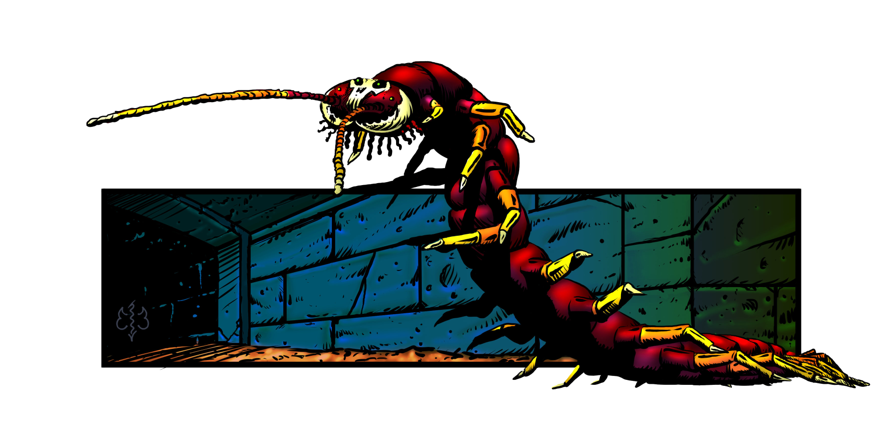

# Saint Frederick’s Crypt

Random encounter table of the crypt of St. Frederick

The GM can use this table to spice up the exploration if the session becomes too calm or monotonous. However these encounters should be used wisely due to the challenging predetermined encounters and traps of the crypt.

One thing to note is that the crawler creature isn’t so random in the sense that it is existent in the crypt but tends to move from corridor to corridor, it hunts vermin found in the area. Although immune to poison it prefers to avoid the lair of the tear drop spider.

Encounter type

| [1D100](/roll/1d100){.screen-only}**1D100**{.print-only} | Qty | Enemy |
|:----:|:----:|:----|
|01-17| [1D6](/roll/1d6){.screen-only}**1D6**{.print-only} | Giant Rats (1/8 CR, 25 XP)|
|18-33| [1D4](/roll/1d4){.screen-only}**1D4**{.print-only} | Giant bats (1/4 CR, 50 XP)
|34-50| [1D6](/roll/1d6){.screen-only}**1D6**{.print-only} | Giant rats (1/8 CR, 25 XP)
|51-66| [1D6](/roll/1d6){.screen-only}**1D6**{.print-only} | Goblins (1/4 CR, 50 XP)
|67-83| [1D4](/roll/1d4){.screen-only}**1D4**{.print-only} | Orcs (1/2 CR, 100 XP)
|84-00| **1** | Specter (1 CR, 200 XP)
{.purple}

(print-column)

## 1: Entrance

{.print-center}

**Read:**

> There is a heavy humidity, and the foul smell of rot assaults your senses as you descend the darkened stairs. Strange sounds caused by the strong, cold wind greet you at the entrance, reverberating through the nearby stairwell. 40 feet down and you begin to feel engulfed by a permeating miasma of death. {.read}

Unless the party has a means of seeing in the dark, the area is pitch black. The ceiling is approximately 10 feet high, the steps about 10 feet wide and about 20 feet long, but the staircase is 40 feet high so the steps are steep.

The ceiling and the walls are made of large stone bricks, however the stairs appear roughhewn, sculpted boulder.

There is a lot of dirt on the steps, tracked in by animals who’ve had direct access to the outside world. The only noises to be heard are the outside winds and the faint sounds of rippling water coming from the basin in the Hall of Welcoming. 

(print-page)

## 2: Hall of Welcoming

**Read:**

> In the middle of this hall you see a large basin filled with murky water to which is affixed a placard engraved with writing. Walls are built from very large and heavy stone bricks. The stone bricks glisten with moisture and are covered with cobwebs. The hall splits into many corridors to the south and east. {.read}

{.print-center}

This corridor features many openings. A stone floor tile is equivalent to 5 feet as shown on the map. Just like the stairs area, the ceiling is about 10 feet high, and the corridor’s dimensions changes with certain areas. Walls are built from very large and heavy stone bricks. The rest of the crypt follows the same pattern and description for ceiling, walls, and floors, unless otherwise stated.

The core center area of the corridor features a large basin facing the exit stairs, a plaque on it reads:

“Wash Thy Sinful Hands All Whom Dare Enter Here, Else Decay Forever in the Irons you’ve Wrought, in the name of Lord Sol”

The basin is now appearing unhallowed, filled as it is with filthy water.

The purpose of the plaque is to discourage superstitious people from exploring further. The clergy of Psarmorum are sure to emphasize that no one is devoid of imperfection. The filthy water is not blessed and has no other purpose whatsoever.

To keep the basin filled and to keep the illusion that it fills itself miraculously by its own, a cleric occasionally comes to fill the basin with nearby spring water.

In the south direction there are two corridors, one which leads to [area 3](saint-fredericks-crypt-3-poisonous-trap-room){.print-only}[area 3](3-poisonous-trap-room){.screen-only} and one which leads to [area 4](saint-fredericks-crypt-4-hall-of-glory-and-honor){.print-only}[area 4](4-hall-of-glory-and-honor){.screen-only}. The one which leads to [area 3](saint-fredericks-crypt-3-poisonous-trap-room){.print-only}[3-poisonous-trap-room](3-poisonous-trap-room){.screen-only} contains two cut slit shapes from floor to ceiling each facing to each other and which hide sliding steel doors that only close if the trap in [area 3](saint-fredericks-crypt-3-poisonous-trap-room){.print-only}[area 3](3-poisonous-trap-room){.screen-only} is triggered.

About 15 to 20 feet east of the basin is a secret passage that only a PC actively searching may discover with a successful Wisdom (Perception) check (vs. Medium-15). The secret doorway is triggered by pushing a brick in the ceiling just over it, and the passage leads to [area 10](saint-fredericks-crypt-10-the-secret-hallways){.print-only}[area 10](10-the-secret-hallways){.screen-only}.

Near the secret passage in the corner, part of the wall has collapsed and filled the floor with rubble. In the debris there is an aggressive and semi-sentient magical construct; a Bull Brick monster, acting as a guardian. It charges if triggered (See below) if a party member gets 5 feet near it.

### Bull Brick

Psarmorum is a land of strange inconsistencies. For one, the Templars tend to fear and distrust magic. But those in power understand demon blood fuels their people’s success and power in keeping the chaos of the unsettled lands from overwhelming them. As such there exists an uncomfortable acceptance of some forms of magic. The glamour of the shee, absolutely anathema, but the deviously lethal contraptions of a Psarmorum Arcanist, that is another matter. In fact, the priesthood encourages the Arcanists who act as curators for the Walk of the Ages in Temple Mount (the Templar Knights’ official hall of history and historical artifacts) to construct defensive measures. Euphemistically known in Psarmorum as the Curators. These magic users fulfil a demand for guardians for places of secluded sacredness around the realm. It’s not just places like the Walk of Ages or Seervall Cathedral that holy relics may be stolen, nor is Temple Mount the only place where these golems and constructs of the Curators are encountered, to the great detriment of would-be thieves.

|||
|---|---|
|[**Encounter: Bull Brick**](bull-brick-encounter){.screen-only}**Encounter: Bull Brick**{.print-only}||
|[1 Bull Brick](/monster/cultist){.screen-only}**1 Bull Brick**{.print-only}|450 XP|
{.enemy}

{.print-center}

(print-page)

```Monster {.purple}
name: Bull Brick
slug: bull-brick
size: Small
type: Construct
alignment: Unaligned
ac: 17 (natural armor)
hp: 13
speed: 30 ft.
str: 15
dex: 10
con: 16
int: 1
wis: 7
cha: 3
resistances: piercing and slashing damage from nonmagical weapons
vulnerabilities: bludgeoning
senses: darkvision 50 ft. passive Perception 10
challenge: 2
token: BullbrickToken.png
image: Bullbrick.png
actions:
  - name: Ram
    description: "Melee Attack: +3 to hit, reach 15 ft (triggered by anyone walking within that distance), one creature. Hit: 15 (2d6+8) bludgeoning damage."  
```

One such creature mimics a large, solitary brick in the wall, created by the Curator Briquemort. It’s a guardian designed to chase cultists away from the sword of Saint Frederick. Hapless thieves rarely notice the construct turned facing the wall with large iron spikes protruding into the shadows. When the mimicking construct detects intruders getting too close, it raises from the ground on it’s odd, human legs (always the repurposed legs and feet of heretics), swiveling around to charge impossibly fast, impaling intruders with its spikes (see Bull Brick, above).

## 3: Poisonous Trap Room

**Read:**

> The first things your party notices in this room are 8 steel-like lids occupying the floor in the center of the room. There’s some rust on them but otherwise they look like they are in good condition. However, there are the corpses of 3 adventurers lying around them, two of them holding their necks in rigamortus. The room also features 4 small sections which feature steel levers which appear to be in a reset position. {.read}


The levers (Which are numbered at their bases!) when pulled in the right combination open the locked stone doors of [area 4](saint-fredericks-crypt-4-hall-of-glory-and-honor){.print-only}[area 4](4-hall-of-glory-and-honor){.screen-only} to reveal the moon and sun fountains. Not all the levers are visible from every vantage point, so it may help to sketch out the map for the players.

{.print-center}

The right combination and order is 146 (the year the paladin dispatched the Harvester). The players must be cautious because if the levers are pulled in the wrong order, the sliding steel doors found in [area 2](saint-fredericks-crypt-2-hall-of-welcoming){.print-only}[area 2](2-hall-of-welcoming){.screen-only} instantly close. This happens lightning fast, triggering the steel floor lids to open and shoot out corrosive, poisonous green vapors that fills the entire room.

The poison is lethal and deals [1D4](/roll/1d4){.screen-only}**1D4**{.print-only} damage each round for [1D4 + 2](/roll/1d4+2){.screen-only}**1D4 + 2**{.print-only} hours unless the target makes a **Constitution Saving Throw versus 15**. It’s nearly impossible not to breath the fumes even when putting a cloth over the mouth. The steel doors are so thick that they were meant to be indestructible.

(print-page)

If the party successfully finds the right combination, a loud mechanical noise can be heard from [area 2](saint-fredericks-crypt-2-hall-of-welcoming){.print-only}[area 2](2-hall-of-welcoming){.screen-only}, and especially area 4 since the steel doors get unlocked. However, the party has only 12 rounds to use the fountains found in [area 4](saint-fredericks-crypt-4-hall-of-glory-and-honor){.print-only}[area 4](4-hall-of-glory-and-honor){.screen-only}, because after that time has passed the levers reset to their original position, causing the doors to close and lock themselves.

It’s also theoretically possible perish from suffocation if stuck behind one of the steel doors when standing in [area 4](saint-fredericks-crypt-4-hall-of-glory-and-honor){.print-only}[area 4](4-hall-of-glory-and-honor){.screen-only}if nobody can activate the levers with the right combination. This is because the steel doors are so thick that they are practically indestructible and form a perfect seal.

{.print-center}

It’s up to the GM to decide if the doors can actually be destroyed or not, but keep in mind that the traps were meant to be deadly, otherwise someone would have succeeded in looting the place long ago.

(Order of levers is 1 and 2 found in the northwest section, 3 and 4 found in the southwest section, 4 and 6 found in the northeast section, and 7 and 8 found in the southeast section of [area 3](saint-fredericks-crypt-3-poisonous-trap-room){.print-only}[area 3](3-poisonous-trap-room){.screen-only}.) As one might guess, the dead adventurers lying on the floor all have been poisoned by the triggered trap.

### Loot

A human arcanist wearing a green hooded robe and simple leather shoes carries 1 belt pouch with 31 gold and 5 silver. He also has 1 scroll case with 2 spells of firebolt (cantrip).

A human warrior sporting a chain shirt, red trousers, soft leather boots, and chain mail armor. He also carries a backpack filled with 1D6 torches, 1 flint and steel, 7 dry rations, a 25 feet hemp rope, and 1 bedroll. The bedroll is wrapped around 1 potion of healing. The man was also armed with a short sword, which is sheathed. 1 belt pouch is also found and contains 24 gold, 13 silver and 37 copper.

The other adventurer who dropped to the floor a bit further south is an elf wearing colorful leather armor, colorful trousers, and colorful high but soft leather boots (elves, colorful even in death!). He carries a footman’s mace. Also tied to his belt is a flute case holding an elaborate wooden flute worth approximately 35 gold due to its quality. Inside his trousers the elf hid 1 belt pouch which contains a copper ring with a sculpted unicorn head, worth approximately 20 gold. The pouch also contains 11 gold, 67 silver, 3 copper and 1 love letter that says “My love my husband is away until the end of the week, please meet with me behind the temple.”

## 4: Hall of Glory and Honor

**Read:**

> The corridor features a huge stone tapestry on the west wall. It depicts scene wherein St. Frederick leads an army of knights in a clash against an army of barbarians. The area also features two steel doors without handles, located in the east wall, and a small 5 feet wide exit found to the southeast. {.read}

{.print-center}

The tapestry’s scenery is glorious in nature, the sun rays shining on St. Frederick’ image. Far to the right of the tapestry there is a hint of a full moon rising. A PC studying the stone tapestry’s meaning with a successful Intelligence-History check (vs. Easy-10) can identify that the battle lasted from sunrise until just after sunset. The sun and the moon represent Lord Sol versus the Evil of Satan and were probably important symbols for St. Frederick.

(print-page)

Facing the tapestry are two plain steel doors, however they can only be unlocked by the levers found in [area 3](saint-fredericks-crypt-3-poisonous-trap-room){.print-only}[area 3](3-poisonous-trap-room){.screen-only} using the right combination. Refer to [area 3](saint-fredericks-crypt-3-poisonous-trap-room){.print-only}[area 3](3-poisonous-trap-room){.screen-only} for more info about the doors and the combination. If the party succeeds in opening the doors they’ll find a fountain behind each of them. One fountain represents the moon and the other represents the sun.

{.print-center}

The basins are enchanted with magical waters. Drinking the moon water cures any poison, and drinking the sun water heals as a 3rd level cure wounds spell once per day (2D8). Drinking more provides no benefit until the next sunrise.

{.print-center}

However, the real purpose of the waters is to be placed in magical bowls upon the moon and sun tiles facing the double doors of St. Frederick's tomb. This is done to open [area 16](saint-fredericks-crypt-16-the-tomb-of-st-frederick){.print-only}[area 16](16-the-tomb-of-st-frederick){.screen-only}. The waters can only be carried in the enchanted bowls, which are found held by the moon and sun virgins respectively, otherwise the waters evaporate instantly.

The moon virgin, and her moon bowl, is found in [area 12](saint-fredericks-crypt-12-the-moon-virgin){.print-only}[area 12](12-the-moon-virgin){.screen-only}, while the sun virgin, and her sun bowl, is found in [area 8](saint-fredericks-crypt-8-the-sun-virgin){.print-only}[area 8](8-the-sun-virgin){.screen-only}. 

## 5: Twin Stairs Hall

**If the party come from [area 2](saint-fredericks-crypt-2-hall-of-welcoming){.print-only}[area 2](2-hall-of-welcoming){.screen-only} read the following:**

> At the end of this wide corridor you notice two passage ways leading north, and one smaller passageway leading south. The southern way is through an open portal into another corridor. Other than those details the area looks empty of unusual details. {.read}

 **If the party come form [area 9](saint-fredericks-crypt-9-skull-crawlers-lair){.print-only}[area 9](9-skull-crawlers-lair){.screen-only} read the following:**

> From the doorway you noticed that the wide corridor ends and splits into twin passages, each featuring staircases which climb about 10 feet high. The west stairs lead into a small room or corridor, while the east stairs lead into a wider area. {.read}

### The Stone Door

The stone door leading into [area 9](saint-fredericks-crypt-9-skull-crawlers-lair){.print-only}[area 9](9-skull-crawlers-lair){.screen-only} is slightly ajar. If the party pays attention, and if coming from [area 2](saint-fredericks-crypt-2-hall-of-welcoming){.print-only}[area 2](2-hall-of-welcoming){.screen-only}, it can hear the skull crawler feeding on the remains of former adventurers (assuming the creature is not wandering the crypt). Regardless if the skull crawler is in its lair or not a foul smell of rotting flesh and blood wafts out of that door. If the skull crawler is out hunting for vermin ([75%](/roll/1d100){.screen-only}**75%**{.print-only} chance that it is!) then there’s nothing to be heard.

In front of that door, up the north the corridor, splits into two passages, each featuring stairways going up leading to [area 14](saint-fredericks-crypt-14-the-halls-of-the-guardians){.print-only}[area 14](14-the-halls-of-the-guardians){.screen-only}. The left passageway once hid a falling brick trap triggered by the floor tile right under it, but the trap got broken a long time ago and the brick is now hanging halfway out, but firmly stuck in position. Pulling the brick out requires a successful Strength check (vs. Easy-10; see rules on Strength and pulling things in Core Rules). Success means the brick gets loose free and falls, creating a loud rumbling sound, filling the area with a lot of dust and dirt. The sound has [25%](/roll/1d100){.screen-only}**25%**{.print-only} chance to attract a random encounter.

(print-page)

## 6: Belt Pouch Corridor

**If the party come from [area 4](saint-fredericks-crypt-4-hall-of-glory-and-honor){.print-only}[area 4](4-hall-of-glory-and-honor){.screen-only} read the following:**

> The corridor drops down 10 feet, down one small descending staircase, followed by 30’ of stone passageway, leading to another staircase leading into darkness. About 15 feet east of the staircase, you notice a small belt pouch on the floor. A perpendicular corridor turning south just before the second staircase is an opening filled with cobwebs. That area feels quite humid.{.read}

**If the party comes from [area 9](saint-fredericks-crypt-9-skull-crawlers-lair){.print-only}[area 9](9-skull-crawlers-lair){.screen-only} read the following:**

> After descending the second stairway, the corridor twists sharply west then immediately east, and about 20 feet west of the staircase, you notice a small belt pouch on the floor. {.read}

The belt pouch found on the floor in this area contains [1D20](/roll/1d20){.screen-only}**1D20**{.print-only} gold, [2D20](/roll/2d20){.screen-only}**2D20**{.print-only} silver, and [2D20](/roll/2d20){.screen-only}**2D20**{.print-only} copper. It was dropped by one adventurer who was eaten by the residing skull crawler. The corridor behind, turning south heading west to [area 7](saint-fredericks-crypt-7-spider-tunnel){.print-only}[area 7](7-spider-tunnel){.screen-only} a corridor filled with thick and wet spider webs crawling with hundreds of spiders.

## 7: Spider Tunnel

> This corridor goes south, then terminates turns to the left (west). It’s difficult to determine any details around the corner due to the huge thick spider webs covering the entire small corridor. There seems to be a medium sized tunnel formed out of thick webs. The area is crawling with thousands of various little spiders.{.read}


There are hundreds of spiders of all kind every 5 feet. Most are not dangerous, but a PC with a spider phobia must succeed with a Wisdom check (vs. Hard-20), or else be incapable of going near that corridor.

What’s unique about these webs is that they are permeated with water drops, making them completely impervious to fire, and the webs themselves are super resistant to cutting. The best way to get rid of them is not by cutting the webs but by rolling the webs around a long object. It works with weapons but then the weapons become so glued and sticky by the webs that they become useless.

A staff is the best weapon/tool to get rid of the webs by this method. One staff, or other pole-arm like weapons, can grab enough webs to clear the passage for 25 feet, otherwise any smaller weapon can roll the webs away for about 5 to 10 feet each (the GM may allow one of the fallen explorers laying in the halls to possess a journal with such a hint concerning the spider corridor).

If a PC is foolish enough to try and pass through the web-filled corridor without removing them first, then he will become entangled so badly that he will fall, or hang in the webs and become completely enwrapped, stuck and paralyzed by them (Strength Check versus 15 to break free before going too deep). Regardless of how the party handles the webs, the moment the teardrop spider from [area 8](saint-fredericks-crypt-8-the-sun-virgin){.print-only}[area 8](8-the-sun-virgin){.screen-only} feels vibration it charges in to kill.

If the passage is cleared, leading halfway to [area 8](saint-fredericks-crypt-8-the-sun-virgin){.print-only}[area 8](8-the-sun-virgin){.screen-only}, large spider eggs can be seen, and a lot of small treasure can be found from the cocoons of victims, as well as in the webs themselves. How the small treasure items are spread in the cocoons or in the webs is up to the GM. Some loot may be impossibly stuck causing a dangerous delay in action.

|||
|---|---|
|[**Encounter: Teardrop Spider**](teardrop-spider-encounter){.screen-only}**Encounter: Teardrop Spider**{.print-only}||
|[1 Teardrop Spider](/monster/teardrop-spider){.screen-only}**1 Teardrop Spider**{.print-only}|200 XP|
{.enemy}

Roll [1D6](/roll/1d6){.screen-only}**1D6**{.print-only} three times to see what items can be pulled out of the glue with ease.

1. A **belt pouch with a gemstone** worth approximately **100 gold**.
2. A **Ring of Luck** worn on a bony finger. The ring grants advantage 3 times per day with any roll and requires attunement. 
3. A [Potion of Speed](https://www.dndbeyond.com/magic-items/potion-of-speed){.print-only}[Potion of Speed](/item/potion-of-speed){.screen-only}.
4. A scroll case with [Scroll of Identify](https://www.dndbeyond.com/spells/identify){.print-only}[Scroll of Identify](/spell/identify){.screen-only}.
5. An iron pot (for cooking!).
6. A **silver brooch of a butterfly** worth approximately **50 gold**.

(print-page)

```Monster {.purple .two-column}
name: Teardrop Spider
slug: teardrop-spider
size: Large
type: Beast
alignment: Unaligned
ac: 14 (natural armor)
hp: 26 (4d10+4)
speed: 30 ft., climb 30 ft.
str: 14
dex: 16
con: 12
int: 2
wis: 11
cha: 4
skills: Stealth +7
senses: blindsight 10 ft., darkvision 60 ft., passive Perception 10
challenge: 1
column-after: traits
column-after-property: Web Sense
token: TeardropSpiderToken.png
image: TeardropSpider.png
traits:
  - name: Fire Immunity
    description: "The spider cannot be harmed by normal fire (magical fire will harm)."
  - name: Spider Climb
    description: "The spider can climb difficult surfaces, including upside down on ceilings, without needing to make an ability check."
  - name: Web Sense
    description: "While in contact with a web, the spider knows the exact location of any other creature in contact with the same web."
  - name: Web Walker
    description: "The spider ignores movement restrictions caused by webbing."
actions:
  - name: Bite
    description: "Melee Weapon Attack: +5 to hit, reach 5 ft., one creature. Hit: 7 (1d8+3) piercing damage. The target must make a DC 11 Constitution saving throw, taking 9 (2d8) poison damage on a failed save, or half as much damage on a successful one. If the poison damage reduces the target to 0 hit points, the target is stable but poisoned for 1 hour, even after regaining hit points, and is paralyzed while poisoned in this way." 
  - name: Web (Recharge 5-6)
    description: "Ranged Weapon Attack: +5 to hit, range 30 ft./60 ft., one creature. Hit: The target is restrained by webbing. As an action, the restrained target can make a DC 15 Strength check, bursting the webbing on a success. The webbing can also be attacked and destroyed (AC 20; hp 5; vulnerability to fire damage; immunity to bludgeoning, poison, and psychic damage)."  
```

Derived from Giant Spider, System Reference Document 5.1 Copyright 2016, Wizards of the Coast, Inc.{.footnote}

{.print-only .print-bottom-right}

{.screen-only}

(print-page)

## 8: The Sun Virgin

**Read:**

> This area appears to be a giant spider nest. However, the opening north of the end of the corridor displays a statue of a beautiful young woman, a golden bowl with the emblem of the sun rests in her sculpted hands. Her fair countenance is juxtaposed by imagines of death, a pile of humanoid skulls lying at her feet among the thick webs. {.read}


Under the pile of skulls is hidden a valuable treasure for the party, a [Dagger of Venom](https://www.dndbeyond.com/magic-items/dagger-of-venom){.print-only}[Dagger of Venom](/item/dagger-of-venom){.screen-only}.

However, the most important treasure found in this area is the golden sun bowl held by the sun virgin to help open the tomb of St. Frederick. Finding this treasure provides the party with **100 bonus XP**.

**Sun bowl**: Filling this bowl with the water from the sun fountain in [area 4](saint-fredericks-crypt-4-hall-of-glory-and-honor){.print-only}[area 4](4-hall-of-glory-and-honor){.screen-only} activates it’s magic and enchants the water. The hence enchanted water must be dropped on its respective tile in [area 15](saint-fredericks-crypt-15-the-moon-and-sun-tiles){.print-only}[area 15](15-the-moon-and-sun-tiles){.screen-only}. When the water flows into tiny cracks of the tile, they lower the tile down which then opens and reveals the key hole (for one of the two keys found and given by the gargoyle statues). However, after about 1 hour the magical bowl vanishes from wherever it is, returning magically to the hands of the sun virgin.

(print-column)

## 9: Skull Crawler’s Lair

**Read:**

> This room stinks with the smell of blood and rot. It is difficult to determine what this room was used for. Against the north wall, lies a small stone table which features pots filled with old herbs, now completely dry. Next to the east wall lies a 20 foot long stone bench. Against the west wall there is a stone armoire. In the south wall a stone door stands slightly ajar, just like the one in the north wall.
>
> Scattered all over the floor are the remains of bones, flesh and blood. Some blood splatters can be seen on some walls too. The stench is unbearable. {.read}

The purpose of this room is to be used by worshipers. The herbs filled in ceramic bowls from the north table were used as perfume by rubbing them against the skin, but now they are dried up and worthless. The stone closet still holds some **ceremonial robes**, [1D4](/roll/1d4){.screen-only}**1D4**{.print-only} of them at least. The satin robes are white and decorated with small golden hem, and are approximately worth **50 gold**. A large steel shield with a Templar crest is also stored in the closet, and although a bit battered, is still in good condition.


The gear of the adventurers killed and eaten here have long been digested by the Skull Crawler, although a Tiara of Seduction can be found submerged in the blood pool. This magical item provides a bonus of +2 to Charisma and is worth approximately **500 gold** (rare).

(print-page)

{.print-only .size-cover}

{.screen-only}

If the Skull Crawler isn’t hunting for vermin, the PCs will notice the creature chewing on some fleshy and bloody bones. It doesn’t notice the heroes if they simply state they’re being quiet, but if they make a noise it instantly attacks the first party member it spots.

|||
|---|---|
|[**Encounter: Skull Crawler**](skull-crawler-encounter){.screen-only}**Encounter: Skull Crawler**{.print-only}||
|[1 Skull Crawler](/monster/skull-crawler){.screen-only}**1 Skull Crawler**{.print-only}|100 XP|
{.enemy}

```Monster {.purple}
name: Skull Crawler
slug: skull-crawler
size: Large
type: Beast
alignment: Unaligned
ac: 15 (natural armor)
hp: 22 (4D10)
speed: 30 ft., climb 30 ft.
str: 10
dex: 14
con: 12
int: 1
wis: 7
cha: 3
senses: blindsight 30 ft., passive Perception 8
challenge: 1/2
token: BoneCrawlerToken.png
image: Bonecrawler.png
actions:
  - name: Bite
    description: "Melee Weapon Attack: +4 to hit, reach 5 ft., one creature. Hit: 7 (1d10+2) piercing damage. The target must succeed on a DC 11 Constitution saving throw or take 10 (3d6) poison damage. If the poison damage reduces the target to 0 hit points, the target is stable but poisoned for 1 hour, even after regaining hit points, and is paralyzed while poisoned in this way." 
```
Derived from Giant Centipede, System Reference Document 5.1 Copyright 2016, Wizards of the Coast, Inc.{.footnote}

(print-page)

## 10: The Secret Hallways

**If the party come from area, read the following:**

> This tight corridor follows a staircase ascending 10 feet, turning left westward after 35’, and, after another 5 feet ahead, turning to the east. {.read}

**If the party come form [area 14](saint-fredericks-crypt-14-the-halls-of-the-guardians){.print-only}[area 14](14-the-halls-of-the-guardians){.screen-only} read the following:**

> Just beyond the secret passage, the tight corridor ends after 15’. The passage then turns left, toward the south, leading into the dark beyond your light source. Then, facing south, you see a corridor turning right, 5’ from where you stand, toward the west. {.read}

The area is devoid of any particular details other than the staircase south. However if the party comes from [area 2](saint-fredericks-crypt-2-hall-of-welcoming){.print-only}[area 2](2-hall-of-welcoming){.screen-only}, then the northeast dead end terminates with the secret passage leading to [area 14](saint-fredericks-crypt-14-the-halls-of-the-guardians){.print-only}[area 14](14-the-halls-of-the-guardians){.screen-only} (Refer to it for the details about finding the secret passageway.)

## 11: Little Note Corridor

**Read:**

> At about 50 feet, the tight, east to west corridor has has another passage heading south. At your feet you notice a piece of parchment. The area smells and feels really moist. {.read}

If a PC picks up the parchment, although the ink has smudged everywhere on it one can still read the following clearly...

(print-column)

> There is no way in hell that we can find this sword, we have tried everything! This place is filled with traps and terrifying creatures I’ve never seen before. Its puzzles are impossible. It is madness, and I doubt the sword even exists. St. Frederick must simply be a myth. I’m done and I quit! I leave this behind to others whom have been sent on a fool’s errand to find this legendary sword. I think it’s a Psarmorum scheme to kill off treasure hunters! But if you do persist let me tell you this, the levers found in the room near the entrance are impossible to work with. There are too many possibilities and we lost many of our party members because of them. The ones not so far from the gargoyles spit fire, roasting anybody triggering them if the combination is wrong. I never found the answer, for fear worse things would be triggered. We’ve lost too many as it was. We found a silver moon bowl held by the statue of a virgin, but we didn’t knew what to do with it. It must have been cursed because after some time, the bowl always ended up back in the hands of the accursed virgin statue! Gilbert thinks the fresco has something to tell or do with the floor slabs found in front of the steel doors near the gargoyle area. Sorry that’s all I can do to help, good luck, you’ll need it. I need to report what little I’ve found to Baltasar the Sage. I tell you this, if you do this for gold you are fools, your lives are much more precious than stupid coins! If you intend to go on, here is a riddle for you: read the prayer opposite to stop the blades of bad fortune
>
> \- Sabrina the Fox. {.paper}

On the back of the note is a very important writing which says... “Mighty St. Frederick please show us the way!” If this sentence is said in [area 16](saint-fredericks-crypt-16-the-tomb-of-st-frederick){.print-only}[area 16](16-the-tomb-of-st-frederick){.screen-only}, it will stop the animated swords.

Other than the note, there is nothing special about this area.

(print-page)

## 12: The Moon Virgin

**Read:**

> The corridor seems to turn west however you are not sure how far it goes. {.read}

At the end of the corridor is found the statue of the moon virgin holding a silver bowl with designs of the moon. Just like [area 8](saint-fredericks-crypt-8-the-sun-virgin){.print-only}[area 8](8-the-sun-virgin){.screen-only}, this bowl is one of the important treasures used to help open the tomb of St. Frederick. Finding this treasure provides the party with 4 CPs.

{.print-center}

**Moon bowl**: Filling this bowl with the water from the moon fountain in [area 4](saint-fredericks-crypt-4-hall-of-glory-and-honor){.print-only}[area 4](4-hall-of-glory-and-honor){.screen-only} activates it’s magic and enchants the water. The hence enchanted water must be dropped on its respective tile in [area 15](saint-fredericks-crypt-15-the-moon-and-sun-tiles){.print-only}[area 15](15-the-moon-and-sun-tiles){.screen-only}. When the water flows into tiny cracks of the tile, they lower the tile down which then opens and reveals the key hole (for one of the two keys found and given by the gargoyle statues). However, after about 1 hour the magical bowl vanishes from wherever it is, returning magically to the hands of the sun virgin.

## 13: The Cursed Sword

**Read:**

> As you get near what appears to be a small room, the area is filled with moss, strange large mushrooms, and other humid vegetation. In the northeast corner of the room there is a pool which has formed, and in it you notice a human skeleton, a gleaming silver sword encrusted with gemstones impaled into its torso. {.read}

{.print-center}

This room was once used for meditation purposes, but long ago it degenerated into a mushroom heaven because of rain water seeping in from the cracked bricks of a bad foundation.

The mushrooms are toxic, emitting an invisible and slowly deliberating gas, but nothing happens immediately. If the party spends more than 10 rounds in this room, the toxin will sicken them for about 1 day. Under such condition, all physical activities are at a -1 to ability rolls (including attacks). The water from the moon fountain in are 4 can cure this poison instantly.

(print-page)

The sword found in the skeleton is cursed. Once taken by the handle it curses its user. The moment a battle begins, the user gets the urge to use it. At first the greatsword seems like a well-balanced magical weapon, esoteric in terms of arcane lore, and it provides +1 to both harm and initiative. This great sword’s name is known as “Master Slayer”, which is a name known to Baltasar the Sage. If the wielder rolls a 1 on any die, then he suffers disadvantage, and the sword animates with possibly lethal consequence, cleaving into its wielder with an attack roll (using the wielder’s own attack bonuses!) instead of the opponent, unless stopped by a Strength check (vs. 15), to prevent it from jumping out of one’s hands. It drops to the ground after that single strike.

Despite this rather severe disadvantage, the user of the sword will never want to get rid of it, blaming it’s animated attacks on some paranoid theory. However, the wielder gets a difficult Wisdom check vs 15 break free of the curse every time he is slashed. Only then may the user can finally drop the accursed weapon.

## 14: The Halls of the Guardians

**If the party come from [area 5](saint-fredericks-crypt-5-twin-stairs-hall){.print-only}[area 5](5-twin-stairs-hall){.screen-only} read the following:**

> As you enter this L shape area, you notice two gargoyle statues. The one located next to the east wall has its head turned to the west, while the other located next to the south wall between the two staircases looks to the north. The gargoyles look demonic in appearance, each with a long tail, bat-like wings and gruesome faces with large, pointy horns. The hall is wide, stretching straight ahead to the north and onward to your left. There is a large archway before the northernmost wall. {.read}

**If the party come from area 10 read the following:**

> When crossing the secret passageway: The corridor you find yourselves has a broken floor, a fissure splitting the rock along the southern path ahead. It looks dangerous to cross. {.read}

This area features many things.

The gargoyles, although life-like, are just statues, but their mouths clearly display a hole that the party will notice instantly. The gargoyles’ function can be triggered by the numbered levers found in the far northern area. If the right combination is used then each gargoyle spits a key from the hole in its mouth. One of keys is made of silver, and the other is made of gold, but the keys are otherwise unremarkable. These keys are to be used for the moon and sun tiles found in [area 15](saint-fredericks-crypt-15-the-moon-and-sun-tiles){.print-only}[area 15](15-the-moon-and-sun-tiles){.screen-only}. The lever combination is 123 (the equivalent of the medieval idiot’s luggage code!), and is etched into the underside of the desk in area However with a wrong combination the lever’s handles all spew fire, which deals [3D6](/roll/3d6){.screen-only}**3D6**{.print-only} damage.

{.print-center}

The altar stands under chandeliers found in the northeast section, and was once used for prayers to Sol. A dusty prayer book sits on the alter. The prayers once told the right combination for the area’s levers, however the paper of the tome pages have all rotten and the tome is now useless (except by some improvised restorative or psychogenic power). One adventurer etched the proper combination into the underside of the altar, which turned out to be 123, a number with no religious significance whatsoever, which was likely by design. The **chandeliers** are made of silver and each are worth approximately **75 gold each**.

{.print-center}

The west corridor area is is very damaged, with cracks everywhere, but the area actually looks worse than it is. The party can actually use that passage safely, while only the floor fissure can prove hazardous. It shouldn’t cause any problems for a careful PC which wants to cross it (unless something terrible arises from out of the fissure! Roll against random encounter table).

(print-page)

## 15: The Moon and Sun Tiles

**Read:**

> The floor features two slabs, one with a moon and one with a sun. Each tile also features a little key hole. The archway displays two elaborate steel doors, however neither of them have handles or visible locks. {.read}

{.print-center}

These double steel doors open the room of St. Frederick’s tomb area. The party must first use the key of the gargoyles found in [area 14](saint-fredericks-crypt-14-the-halls-of-the-guardians){.print-only}[area 14](14-the-halls-of-the-guardians){.screen-only} to activate the moon and sun tiles before these doors will open. Doing so will unlock and push the tiles deeper into the ground.

That said, an expert thief with thief tools can unlock them (**DC 25**). However, once the tiles have been pushed deeper into the ground, the party must pour the enchanted water onto the tiles using the moon and sun bowls. If this is done correctly, the water will fill each tile and the double steel doors open for a full hour, until everything resets.

If all is done right, the party can finally proceed into the tomb area.

## 16: The Tomb of St. Frederick

**Read:**

> The steel doors open and give way to a large circular room, its ceiling about 20 feet high. Near the center of the room lies what appears to be the sarcophagus of St. Frederick. 12 ornamental long swords are arranged on the floor surrounding the sarcophagus. The swords float up into the air and begin to spin and weave with blurring speed as you approach the body of St. Frederick. {.read}

This is the sarcophagus of St. Frederick. In it can be found the bones of the paladin, along with his legendary holy sword “Demon Hunter”. The sarcophagus also contains a magical set of [elven chain armor](https://www.dndbeyond.com/magic-items/elven-chain){.print-only}[elven chain armor](/item/elven-chain){.screen-only}. To open the sarcophagus, a successful Strength check is required (vs Medium-15), unless the party come up with a better solution.

{.print-center}

The animated swords act as guardians. However, they do not move out of their circle. They attack viciously anything that crosses them. Treat it exactly as a permanent Blade Barrier (6th level evocation). A creature may attempt Dexterity saving throw to avoid some of the blades, or take [6D10](/roll/6d10){.screen-only}**6D10**{.print-only} slashing damage. But even on a successful save, one suffers half as much damage.

The only other way (and the better way) to stop the whirling blades is by saying the sentence “Mighty St. Frederick please show us the way!” A clue is found on the note in [area 11](saint-fredericks-crypt-11-little-note-corridor){.print-only}[area 11](11-little-note-corridor){.screen-only}. When the words are spoken, the swords drop to the floor and won’t trigger for another 24 hours. Once the floor they cannot be picked up (just as difficult as lifting Thor’s hammer or retrieve Excalibur from the stone).

Once the party has the sword they can finally go hunting the Harvester of Souls. If the party decides to leave with the sword and never return, then not only will they become outlaws and have a bounty on their head, but the Harvester of Souls will actually hunt them down too simply for taking the weapon it fears.